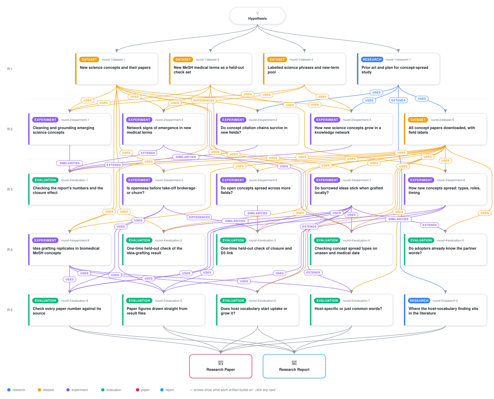

# Host vocabulary predicts whether new scientific concepts take root across disciplinary boundaries

<div align="center">

<a href="https://cdn.jsdelivr.net/gh/ai-inventor-papers/ai-invention-8892b7-occupancy-is-not-integration-for-new@fork/run_F1tk5OGtH84L/workflow.svg">
<picture>
  <source media="(prefers-color-scheme: dark)" srcset="workflow-dark.svg">
  
</picture>
</a>

<sub>🖱️ <b><a href="https://cdn.jsdelivr.net/gh/ai-inventor-papers/ai-invention-8892b7-occupancy-is-not-integration-for-new@fork/run_F1tk5OGtH84L/workflow.svg">Open the interactive diagram</a></b> — every card links to its artifact folder.</sub>

</div>

> **TL;DR** — The host-vocabulary share of a scientific concept's first co-occurring partners in a new disciplinary subfield predicts five-year newcomer uptake. On an independent MeSH biomedical replication population of 191 concepts, a one-standard-deviation increase in host-vocabulary share raises the incidence-rate ratio to 1.23 (95% CI 1.12 to 1.36; pre-registered, verdict REPLICATED). Development-set estimates on the main-arm folds are concordant (Screen IRR 1.30, Held-out IRR 1.19). The strict fixed-effects specification is inconclusive on the Held-out fold (IRR 0.98, 95% CI 0.70-1.37, 30 clusters). The effect is host-specific rather than a proxy for generic concept accessibility, operates through both extensive and intensive margins, and does not vary by origin field. Co-transfer of origin companions is null. A complementary structural finding is that persistent-neighbour closure is lower before sustained uptake (panel coefficient -1.07, Holm p = 0.015; event-study standardised mean difference -0.83, 95% CI [-1.71, -0.10]), indicating emerging concepts sit in locally open, fast-renewing neighbourhoods that are not brokered in Burt's sense.

<details>
<summary>Full hypothesis</summary>

HEADLINE CLAIM (RQ2; CONFIRMED on a sealed held-out fold and REPLICATED in a second population; mechanism still open). When an emerging concept enters a subfield d other than its origin, how HOST-LEANING the vocabulary it is combined with at entry is predicts how much it is TAKEN UP in d over the next five years (W2 papers by author-disjoint newcomers, as defined in art_2Cd2JJypeGuA). A_cont (mean pre-entry host share of the entry-year co-occurrence partners) raises newcomer uptake beyond entry volume, host momentum, relatedness density (RD) and global centrality. Arriving with the concept's origin companions (co-transfer, CT; the 'toolkit' rival) adds nothing in any fold or population. This separates OCCUPANCY (being present in d, which breadth indicators such as subfield count, Shannon, Rao-Stirling and participation measure) from ROOTING (being taken up by d's own newcomers).

Expected sentence of the paper: 'Whether a concept takes root in a new field depends less on how much of it arrives, or on whether its original toolkit arrives with it, than on how host-leaning the vocabulary it is first combined with there is. This graded effect holds on a sealed fold and in biomedicine; it governs how much newcomer uptake follows, not (on held-out) whether a binary establishment threshold is crossed.'

EVIDENCE OF RECORD (each row must be cited in the paper with its artifact id and file path).
(1) SCREEN (art_2Cd2JJypeGuA; prereg f800a0a9): co-primary FE (concept + e + host) A_cont IRR/SD 1.30 [1.16, 1.45], N 1,544, G 140. Primary within-concept-year FE 1.39 [0.97, 1.99], Holm 0.15, underpowered. Primary CT 1.04 [0.72, 1.50], p 0.85; co-primary CT 1.05, p 0.48. Robustness recount (art_WZ8fbLn79nCq robustness_recount.json): 20 of 26 co-primary rows significant INCLUDING the base row and strata, 18 of 22 EXCLUDING them; the iteration-3 '26 of 27' is withdrawn.
(2) HELD-OUT CONFIRMATION (art_WZ8fbLn79nCq; spec 8db17113; opened once, lock file). Co-primary 1.187 [1.057, 1.335], N 972, G 74. Kill rule (CI includes 1 or sign reverses) NOT triggered. Inferential caveats table, all rows mandatory: CRV1 p 0.0045; Holm 0.009; wild 0.012; nativeness permutation 0.026; placebo-calibrated 0.034 (screen SD) / 0.024 (held-out SD); within-concept A-shuffle permutation 0.050 (audit/audit_perm.json, borderline); CRV1 rejects 17.5% of null shuffles (anti-conservative). Primary FE 0.98 [0.70, 1.37], G 30, inconclusive as pre-declared; primary heterogeneity screen b 5.95 vs held-out -0.37, p 0.17. Screen vs held-out co-primary heterogeneity p 0.25. 7 of 7 held-out spec-robustness rows significant. Pre-registered BINARY establishment (EST_bin LPM): A_cont p 0.165 (co-primary), 0.997 (primary): the confirmed effect is on the newcomer-paper COUNT, not on establishment. Out-of-sample deviance gain on main -0.50 [-1.24, 0.02]: explanatory, not predictive, on main.
(3) SECOND POPULATION (art_XGdzjWgi-a88; spec b7cdabf8; 191 MeSH concepts never screened for D2). Co-primary 1.233 [1.117, 1.361], Holm 9.7e-5, wild 0.001, N 2,171, 160 concepts; primary FE 1.324 [1.098, 1.598], p 0.0037 (the primary spec, underpowered on main, is significant here). CT 1.104, Holm 0.053. Placebo host 1.031 [0.963, 1.103]. Nativeness permutation p 0.010 / 0.045. Rows R3 1.251, R4 1.383, exact-only 1.243, unprofiled=1 1.722, S6 null 1.007 [0.69, 1.48] (N 123). Out-of-fold deviance +0.146 [0.008, 0.306]. IVW main + MeSH 1.262 [1.173, 1.358], I2 0; harmonisation rows move main only to 1.289-1.299. SCOPE, verbatim caveats: REPLICATED for biomedicine -> biomedicine host entries only (entries into non-biomedical hosts dropped; coverage rule removes 34% of partner-qualified entries; the declared kw5 design had 46 concepts, so the pre-declared F6 widening fired); PMID-only entry years match all-works entry years for 50% of entries on the 13 fully retrieved concepts; MeSH is not wholly unseen (exp_4 used it for RQ1); CRV1 null size 0.105 in simulation.
(4) MECHANISM TESTS (pooled screen + held-out; label POOLED, PARTIALLY PRE-SPECIFIED, because the held-out G rows were not in heldout_spec and the screen G rows were not blind). G1 multi-team entries: pooled 1.28 [1.11, 1.48]; held-out alone 1.19 [0.98, 1.44], p 0.08; single-paper rows stronger on held-out (interaction ratio 0.80, p 0.004). Not a single-paper artefact on pooled data; MeSH G1 1.079 [0.956, 1.219] undetected (MDE 1.30). The '83% single-paper' figure has no source file and is removed; the traceable figure is 87% of screen co-primary events (1,344 of 1,544). G3 classifier controls change log-IRR by -7% [-28, 7]; placebo host passes in all folds. G3(iii), the only citation-independent (venue ASJC) control, is NOT ESTIMABLE (coverage 12%; degenerate on screen, fails on held-out): every working G3 control comes from OpenAlex's own classifier. G2a: NATIVE (>= 0.3) 1.11 [1.05, 1.19], ADJACENT (0.05-0.3) 1.32 [1.20, 1.46]; held-out Holm p 0.071 / 0.059; equal-per-0.1 Wald p 0.64; G2b positive in all share classes. Label: 'host-vocabulary', read as a GRADED HOST-LEANING GRADIENT, not attachment to strongly native concepts (binary cut-offs >= 0.5 / >= 0.7 remain null).
(5) ADOPTER LEVEL (art_FZ2OCJwV6xHs; screen only; mechanism evidence, not confirmation). W2 newcomer adopters vs exact-matched risk-set controls (bins: prior works, team size, host activity, first year): prior corpus exposure to c's entry partners OR 3.09 [2.32, 4.28] (pre-declared primary m2; prevalence 0.79 vs 0.61, risk ratio about 1.3). Specific to c's partners over frequency-matched negative-control concepts (NEG 0.62) and over partners of another concept's entry into the same host (PLAC 0.72). Carried by FOREIGN 2.88 > ADJACENT 1.91 > NATIVE 1.47 (native/foreign 0.51 [0.33, 0.89]); origin companions 3.10 vs 1.36. No interaction with A_cont (0.87 [0.70, 1.14]); the pre-exposed pool does not mediate A_cont (Gelbach 0.05 [-0.08, 0.23]). Limits: 87% of 21,941 adopter pairs have no prior corpus work and are excluded; exposure is corpus-only (0 OpenAlex credits); prior use of partners is equally consistent with topical proximity (Jia, Wang & Szymanski 2017, local interest drift). Reading: CONSISTENT WITH absorptive capacity OR topical proximity; adopters are frontier-adjacent people who already use c's origin vocabulary, and host-leaning entries raise uptake NOT by enlarging that pre-exposed pool. The entry-level and actor-level results are two different channels and must not be merged into one story.
(6) TYPE x ROOTING (art_mu0h0npvNX_u). BROAD concepts: 18.4 vs 6.6 host entries per concept; EST 0.31 vs 0.13; raw A_cont LOWER, -0.017 [-0.025, -0.010]; adjusted (host x year FE + RD) null on screen (-0.0018) and held-out (+0.0005 [-0.010, 0.011]): the declared 'BROAD higher host share' prediction FAILED. Declared 'BROAD lower co-transfer' REPLICATED: -0.126 screen, -0.125 [-0.19, -0.06] held-out. PPML A_cont by type: BROAD 1.36 [1.20, 1.55], LOCALISED 1.16 [0.98, 1.38], interaction p 0.11 (exploratory). Reading: the typology measures occupancy; host share predicts rooting within both types; broadly integrated concepts travel less as packages.

ITERATION 5 = FINAL. DEEPEN THE CONFIRMED EFFECT WITH THREE CHEAP TESTS, THEN WRITE THE PAPER. All folds are now opened, so every new row is labelled POST-CONFIRMATION EXPLORATORY. One spec (definitions, thresholds, decision rules below) is frozen and sha256-hashed before any coefficient. $0, CPU only, vendored exp_7 / exp_9 code; budget at most about 20% of the iteration. No re-screen, no subgroup search, no new population.
(K1) WHICH MARGIN. Rival: A_cont raises volume where uptake happens anyway, so it cannot decide whether a concept roots. Hurdle decomposition in the co-primary FE on screen, held-out and MeSH separately and IVW-pooled: extensive margin (any W2 newcomer paper; LPM/logit) vs intensive margin (PPML on entries with >= 1 newcomer paper), plus EST_bin. Both outcomes are reportable: 'host-leaning entries decide WHETHER uptake starts' (extensive CI excludes 0) or 'they scale uptake that starts for other reasons' (only intensive), which then becomes the stated boundary of the claim.
(K2) HOST-SPECIFIC vs GENERIC VOCABULARY. Rival (from ADJACENT > NATIVE and the FOREIGN-heavy adopter profile): host-leaning partners are simply generic, widely used terms that make any paper accessible. Add jointly (a) partner generality (mean pre-entry subfield Shannon entropy of the partners' profiles, mean log global frequency) and (b) A_lift (the partners' pre-entry host share divided by d's share of all works in the same block). Decision rule: the reading is 'HOST-SPECIFIC' if A_lift keeps a CI excluding 1 and A_cont retains >= 50% of its log-IRR after the generality controls. It is 'GENERIC ACCESSIBILITY' if the generality controls remove > 50% of the log-IRR. Either is a positive answer to what separates rooting from occupancy.
(K3) BOUNDARY BY FIELD. The physics screen null (0.99) is tested once as a pre-declared moderator (Physics/Astro vs CS vs other) on screen + held-out pooled, with MeSH as the biomedical row. Reported as the boundary; never used to re-select a sample.
If a K-test breaks, it is reported as not run; nothing is fixed after outcomes are seen.

RQ1 (SETTLED; reported under the pre-declared kill rule, NOT rescued). R1_DEAD (art_zw_JJGsUFSnd; eval_spec 099d0881; frozen kill mapping). Pooled-panel held-out raw closure -0.391 [-0.855, 0.072], Holm 0.147; turnover-residualised -0.109, Holm 0.635; event-study rows closure -0.534 [-1.200, 0.074], resT -0.266 [-0.891, 0.300]; IVW resT -0.287 [-0.605, 0.032]. RQ1 SENTENCE: 'Structural precursors of sustained uptake are volume/churn correlates.' Qualification, stated after the sentence and never before it: persistent-neighbour closure is significant on held-out (pooled panel -1.073 [-1.858, -0.289], Holm 0.015; event study -0.826 [-1.706, -0.096]), but its screen event-study CI included 0 (-0.575 [-1.270, 0.122]), the pre-declared fallback added 70 screen never-concepts to the control side (17 of 25 event-study controls are screen concepts), and balance is poor (H SMD 0.96; 6 of 11 covariates |SMD| > 0.25); H-matched subset (n 11) resT -0.536 [-0.93, -0.13]. Reading test 'focused in the wide ego network, open at the top' NOT_SUPPORTED. BROKERAGE ANSWERED: the request's 'increasing structural brokerage' pathway is ruled out for emerging concepts: Burt constraint is HIGHER on both folds (screen +0.083 [0.017, 0.147]; held-out +0.105 [0.021, 0.187]) and effective size LOWER on held-out (-27.8 [-49.3, -9.5]); pooled-panel wmz +0.037 [0.006, 0.067]. Prediction: precursors add nothing to frequency/burst + degree + entropy baselines (dAUC -0.001 [-0.008, 0.006]). The Cheng 2023 vs Salatino 2017 tension is moot as a confirmed finding and is discussed as such. E_up remains a post-hoc label and is disclosed.
RQ1 PATTERNS (descriptive answers the request asks for): main-pool concepts are 'born expanding' (incubation-then-expansion 0 main vs 0.17 MeSH); early bridging is common and non-discriminating (0.70 screen, 0.71 held-out, 0.59 MeSH); gradual centralisation 3%.

D3 LINK: NULL (screen +0.025 [-0.199, 0.242]; held-out +0.053 [-0.279, 0.391]). The 'one mechanism at two scales' sentence is dropped; closure and grafting are reported as two independent findings.

RQ2 DESCRIPTIVE LAYER (frozen, held-out opened once; art_QKsLguxnGFQT + art_mu0h0npvNX_u).
(T) Typology k = 2 (LOCALISED vs BROAD-FROM-THE-START), min Jaccard 0.861; held-out BROAD 0.35 [0.26, 0.45] vs screen 0.33, within support (KS p 0.13, 7% out of support). MeSH is LARGELY OUTSIDE support (12.6% out, KS p 4e-17; BROAD 0.71): its assignment is descriptive only. No gain over an entropy-only typology.
(L) Lead-lag: expansion first in 25 of 26 dual-onset main concepts (N 302; 10 of 10 held-out), but diffusion onsets are rarer (log-rank p 0.005), the evaluability rule favours this order, the F <= 2012 cohort has only 12 dual-onset concepts, and the Granger panel is b -0.0013, p 0.068 (NEGATIVE). MeSH 9 of 13 = 0.69 vs year-shuffle null 0.62, p 0.43: NOT different from null. Stated conditionally, never as an unconditional percentage.
(Ro) Roles: BRIDGE 0.61 screen / 0.60 held-out (seed agreement 0.976) / 0.88 MeSH; CORE_GROWING and FOUNDER never fire in any population (max within-module z -0.23 / -0.20): within the 2024 horizon emerging concepts join communities as connectors, never as module cores. Lagged roles do not predict entry (the OR flips sign, 0.64 screen vs 1.86 held-out; E4 FAIL). MeSH seed stability not assessed.
(C) Four medoid cases (wireless backhaul, EPR steering, locally repairable code, holographic QCD), transcribed from art_mu0h0npvNX_u results/case_interpretations.md, cases_rooting.json and case_entries.csv: subfield shares F+1 -> onset -> 2022, role path, Guimera-Amaral P, betweenness, and rooted vs unrooted host entries. In both BROAD cases the single rooted entry had the highest A_cont (+0.062, +0.115); holographic QCD has no rooted entry. Activity 6 becomes DONE.

CLOSED (one sentence each, no budget): D1 openness -> breadth (screen Holm 0.405, held-out all CIs include 0); citation-lineage viability (Gate A failed, 17.3%); co-transfer as mechanism; 3-channel typology gain over entropy; roles -> entry; demic/cultural routes (not run; the adopter test is the nearest evidence).

PAPER (iteration 5, ANS format; this is the run's deliverable and takes priority over K1-K3). (a) Methodology figure drawn from a single '[Added in iteration 4] Final design as executed' block: one line per construct (E_up, A_cont, CT, Y_strict newcomer count, EST_bin, persistent-neighbour closure, folds) with its source artifact; the population flow (screen 202 -> held-out 100 concepts; D2 1,544 screen / 972 held-out events; MeSH 2,171); the decision path (source-sink hypothesis -> Gate A fail -> graft fallback -> screen -> sealed fold -> MeSH -> adopter test) with dead branches greyed and R1 marked DEAD; adopter OR shown as 3.09. (b) Per-RQ setup, related-work comparison, results, discussion. (c) Nearest neighbours: Cheng et al. 2023 (ASR 88(3)) for grafting, stating that our outcome is newcomer paper counts and the binary establishment outcome is null on held-out; Guevara et al. 2016 and Hidalgo et al. 2018 for relatedness (we control RD); Jia, Wang & Szymanski 2017 and Hofstra et al. 2020 (PNAS) for the adopter result; Cohen & Levinthal 1990 only as one of two readings; Salatino 2017, Chen 2009, Burt, Rotolo 2015 for RQ1.

RECORD FIXES THE PAPER STEP MUST MAKE (from the iteration-4 review; each with an inline '[Correction, iteration 4: ... source: ...]' marker).
- Opening summary, 'What we have learned' heading and the fig_methodology description: replace the rescued RQ1 sentence with the R1_DEAD statement above.
- Rewrite Table 18 with columns 'claimed' | 'actually done (line numbers)' | 'still open'. Then make the fixes in place: primary CT 1.04 [0.72, 1.50], p 0.85; robustness '20 of 26 incl. base and strata; 18 of 22 excl.'; correct the iteration-3 '26 of 27'; label Table 13's -0.758 as S_raw_cc; give n_matched = 14 for the fresh replication; Artifact 2 cites the workspace path iter_1/gen_art/gen_art_dataset_2 (not art_eR1Z7fMlOcxs); add Holm columns to Table 14; transcribe the MISSING_IN_REPORT rows for exp_1-exp_4 from art__i2cIye01VnN record_of_numbers.csv (292 rows; SENS2 -0.858 [-1.668, 0.034]; r1a correlations -0.33 / -0.42; Granger row), marked '[Added in iteration 4]'.
- Artifact 16: add the 'Grafting: inferential caveats' table; replace Table 20's untraceable 'multi' column (1.14 / 1.09) with the G1-multi rows from g_*_rows.csv; give held-out G2a Holm p values; mark G3(iii) not estimable; remove the untraceable 83%; correct 'host-native partners predict establishment' (EST_bin is null on held-out).
- Artifact 17: add the verbatim scope caveats; the verdict reads 'REPLICATED for biomedicine -> biomedicine host entries'; add the R3, R4, S3, exact-only, unprofiled and S6 rows.
- Artifact 20: replace '3.1x more likely' with 'OR 3.09 [2.32, 4.28] (prevalence 0.79 vs 0.61)'; correct the NEG, PLAC and matching descriptions; add the coverage, zero-credit and topical-proximity limits and the robustness grid (1:3 matched 2.96; expanded frame 2.62; Physics 3.87; CS 3.46; single-paper 3.59 vs multi 2.33; origin-subfield check 30% vs 12%, OR 2.52 [1.91, 3.43]). Downgrade 'SUPPORT for absorptive capacity' to 'consistent with absorptive capacity or topical proximity'.
- Artifact 19: add the type x rooting table, the MeSH support numbers, the MeSH lead-lag null, the log-rank / F <= 2012 / Granger rows, the held-out role and cross-tab rows (origin V 0.28-0.30, pooled Holm 0.001; E_up held-out Holm 0.016) and a 'Representative cases' subsection.
- Iteration-4 Strategy: add the diagnosis, the rationale for the five slots, a verbatim copy of 'DECISION RULES FOR THE PAPER (fixed now)' with its source, and a 'Decision-rule evaluation' table: D2 kill rule not triggered (co-primary CI 1.06-1.33); mechanism label host-vocabulary (pooled, partially pre-specified; artefact conditions not met: G1 CI excludes 1, G3 removes -7%); G4 REPLICATED (biomedicine -> biomedicine); R1_DEAD; D3 NULL, so the unifying sentence is dropped; D1 null. Add the 'Plan for iteration 5' paragraph.
- Coverage table: activity 3 'Done: R1_DEAD, volume/churn correlates; brokerage ruled out'; activity 5 'k = 2 replicates on held-out; MeSH descriptive only'; activity 6 Done; activity 1 Partial (substrate is Wikidata-linked legacy concepts; pool concepts attached; merger recall 0.22/0.13; silver labels only; no human check).

GROUNDING AND SUBSTRATE (unchanged, stated plainly). About 27k OpenAlex legacy-concept nodes (Wikidata-linked) from the background sample; the pool concepts are text-mined, classifier-filtered and attached, 312 of 366 kept unlinked. Pool is physics/CS-skewed (arXiv-mined); retrieval route is a covariate.

EVIDENCE PARTITION. SCREEN: 202 MAIN concepts, 1,544 co-primary D2 events. CONFIRMATION (consumed, opened once each in iteration 4): R1 535c2dd3, D2 8db17113, D1 descriptive 8f4bc85d, typology 695166b4. SECOND POPULATION for D2: MeSH (spec b7cdabf8). Everything run in iteration 5 is post-confirmation exploratory.

</details>

[](https://ai-inventor-papers.github.io/ai-invention-8892b7-occupancy-is-not-integration-for-new/fork/run_F1tk5OGtH84L/) [](https://ai-inventor-papers.github.io/ai-invention-8892b7-occupancy-is-not-integration-for-new/fork/run_F1tk5OGtH84L/interactive.html)

[](https://cdn.jsdelivr.net/gh/ai-inventor-papers/ai-invention-8892b7-occupancy-is-not-integration-for-new@fork/run_F1tk5OGtH84L/paper.pdf) [](https://cdn.jsdelivr.net/gh/ai-inventor-papers/ai-invention-8892b7-occupancy-is-not-integration-for-new@fork/run_F1tk5OGtH84L/report.pdf) [](https://cdn.jsdelivr.net/gh/ai-inventor-papers/ai-invention-8892b7-occupancy-is-not-integration-for-new@fork/run_F1tk5OGtH84L/exec_summary.pdf) [](https://cdn.jsdelivr.net/gh/ai-inventor-papers/ai-invention-8892b7-occupancy-is-not-integration-for-new@fork/run_F1tk5OGtH84L/round-5/report.pdf) [](https://github.com/ai-inventor-papers/ai-invention-8892b7-occupancy-is-not-integration-for-new/tree/fork/run_F1tk5OGtH84L/paper_latex)

**Round reports:** [Round 1](https://cdn.jsdelivr.net/gh/ai-inventor-papers/ai-invention-8892b7-occupancy-is-not-integration-for-new@fork/run_F1tk5OGtH84L/round-1/report.pdf) · [Round 2](https://cdn.jsdelivr.net/gh/ai-inventor-papers/ai-invention-8892b7-occupancy-is-not-integration-for-new@fork/run_F1tk5OGtH84L/round-2/report.pdf) · [Round 3](https://cdn.jsdelivr.net/gh/ai-inventor-papers/ai-invention-8892b7-occupancy-is-not-integration-for-new@fork/run_F1tk5OGtH84L/round-3/report.pdf) · [Round 4](https://cdn.jsdelivr.net/gh/ai-inventor-papers/ai-invention-8892b7-occupancy-is-not-integration-for-new@fork/run_F1tk5OGtH84L/round-4/report.pdf) · [Round 5](https://cdn.jsdelivr.net/gh/ai-inventor-papers/ai-invention-8892b7-occupancy-is-not-integration-for-new@fork/run_F1tk5OGtH84L/round-5/report.pdf)

This repository contains all **24 artifacts** produced across **5 rounds** of an autonomous AI research run — round by round, exactly in the order they were invented.

## Round 1

| Artifact | Type | Demo | Source | Builds on |
|----------|------|------|--------|-----------|
| **[New science concepts and their papers](https://github.com/ai-inventor-papers/ai-invention-8892b7-occupancy-is-not-integration-for-new/tree/fork/run_F1tk5OGtH84L/round-1/dataset-1)** | [](https://github.com/ai-inventor-papers/ai-invention-8892b7-occupancy-is-not-integration-for-new/tree/fork/run_F1tk5OGtH84L/round-1/dataset-1) | [](https://colab.research.google.com/github/ai-inventor-papers/ai-invention-8892b7-occupancy-is-not-integration-for-new/blob/fork/run_F1tk5OGtH84L/round-1/dataset-1/demo/data_code_demo.ipynb) | [](https://github.com/ai-inventor-papers/ai-invention-8892b7-occupancy-is-not-integration-for-new/tree/fork/run_F1tk5OGtH84L/round-1/dataset-1/src) | — |
| **[New MeSH medical terms as a held-out check set](https://github.com/ai-inventor-papers/ai-invention-8892b7-occupancy-is-not-integration-for-new/tree/fork/run_F1tk5OGtH84L/round-1/dataset-3)** | [](https://github.com/ai-inventor-papers/ai-invention-8892b7-occupancy-is-not-integration-for-new/tree/fork/run_F1tk5OGtH84L/round-1/dataset-3) | [](https://colab.research.google.com/github/ai-inventor-papers/ai-invention-8892b7-occupancy-is-not-integration-for-new/blob/fork/run_F1tk5OGtH84L/round-1/dataset-3/demo/data_code_demo.ipynb) | [](https://github.com/ai-inventor-papers/ai-invention-8892b7-occupancy-is-not-integration-for-new/tree/fork/run_F1tk5OGtH84L/round-1/dataset-3/src) | — |
| **[Labelled science phrases and new-term pool](https://github.com/ai-inventor-papers/ai-invention-8892b7-occupancy-is-not-integration-for-new/tree/fork/run_F1tk5OGtH84L/round-1/dataset-4)** | [](https://github.com/ai-inventor-papers/ai-invention-8892b7-occupancy-is-not-integration-for-new/tree/fork/run_F1tk5OGtH84L/round-1/dataset-4) | [](https://colab.research.google.com/github/ai-inventor-papers/ai-invention-8892b7-occupancy-is-not-integration-for-new/blob/fork/run_F1tk5OGtH84L/round-1/dataset-4/demo/data_code_demo.ipynb) | [](https://github.com/ai-inventor-papers/ai-invention-8892b7-occupancy-is-not-integration-for-new/tree/fork/run_F1tk5OGtH84L/round-1/dataset-4/src) | — |
| **[Prior art and plan for concept-spread study](https://github.com/ai-inventor-papers/ai-invention-8892b7-occupancy-is-not-integration-for-new/tree/fork/run_F1tk5OGtH84L/round-1/research-1)** | [](https://github.com/ai-inventor-papers/ai-invention-8892b7-occupancy-is-not-integration-for-new/tree/fork/run_F1tk5OGtH84L/round-1/research-1) | [](https://github.com/ai-inventor-papers/ai-invention-8892b7-occupancy-is-not-integration-for-new/blob/fork/run_F1tk5OGtH84L/round-1/research-1/demo/research_demo.md) | [](https://github.com/ai-inventor-papers/ai-invention-8892b7-occupancy-is-not-integration-for-new/tree/fork/run_F1tk5OGtH84L/round-1/research-1/src) | — |

## Round 2

| Artifact | Type | Demo | Source | Builds on |
|----------|------|------|--------|-----------|
| **[All concept papers downloaded, with field labels](https://github.com/ai-inventor-papers/ai-invention-8892b7-occupancy-is-not-integration-for-new/tree/fork/run_F1tk5OGtH84L/round-2/dataset-5)** | [](https://github.com/ai-inventor-papers/ai-invention-8892b7-occupancy-is-not-integration-for-new/tree/fork/run_F1tk5OGtH84L/round-2/dataset-5) | [](https://colab.research.google.com/github/ai-inventor-papers/ai-invention-8892b7-occupancy-is-not-integration-for-new/blob/fork/run_F1tk5OGtH84L/round-2/dataset-5/demo/data_code_demo.ipynb) | [](https://github.com/ai-inventor-papers/ai-invention-8892b7-occupancy-is-not-integration-for-new/tree/fork/run_F1tk5OGtH84L/round-2/dataset-5/src) | <sub><i>uses:</i><br/>[research‑1&nbsp;(R1)](https://github.com/ai-inventor-papers/ai-invention-8892b7-occupancy-is-not-integration-for-new/tree/fork/run_F1tk5OGtH84L/round-1/research-1)</sub> |
| **[Cleaning and grounding emerging science concepts](https://github.com/ai-inventor-papers/ai-invention-8892b7-occupancy-is-not-integration-for-new/tree/fork/run_F1tk5OGtH84L/round-2/experiment-1)** | [](https://github.com/ai-inventor-papers/ai-invention-8892b7-occupancy-is-not-integration-for-new/tree/fork/run_F1tk5OGtH84L/round-2/experiment-1) | [](https://colab.research.google.com/github/ai-inventor-papers/ai-invention-8892b7-occupancy-is-not-integration-for-new/blob/fork/run_F1tk5OGtH84L/round-2/experiment-1/demo/method_code_demo.ipynb) | [](https://github.com/ai-inventor-papers/ai-invention-8892b7-occupancy-is-not-integration-for-new/tree/fork/run_F1tk5OGtH84L/round-2/experiment-1/src) | <sub><i>uses:</i><br/>[dataset‑4&nbsp;(R1)](https://github.com/ai-inventor-papers/ai-invention-8892b7-occupancy-is-not-integration-for-new/tree/fork/run_F1tk5OGtH84L/round-1/dataset-4)<br/>[dataset‑3&nbsp;(R1)](https://github.com/ai-inventor-papers/ai-invention-8892b7-occupancy-is-not-integration-for-new/tree/fork/run_F1tk5OGtH84L/round-1/dataset-3)<br/>[dataset‑1&nbsp;(R1)](https://github.com/ai-inventor-papers/ai-invention-8892b7-occupancy-is-not-integration-for-new/tree/fork/run_F1tk5OGtH84L/round-1/dataset-1)</sub> |
| **[Do concept citation chains survive in new fields?](https://github.com/ai-inventor-papers/ai-invention-8892b7-occupancy-is-not-integration-for-new/tree/fork/run_F1tk5OGtH84L/round-2/experiment-2)** | [](https://github.com/ai-inventor-papers/ai-invention-8892b7-occupancy-is-not-integration-for-new/tree/fork/run_F1tk5OGtH84L/round-2/experiment-2) | [](https://colab.research.google.com/github/ai-inventor-papers/ai-invention-8892b7-occupancy-is-not-integration-for-new/blob/fork/run_F1tk5OGtH84L/round-2/experiment-2/demo/method_code_demo.ipynb) | [](https://github.com/ai-inventor-papers/ai-invention-8892b7-occupancy-is-not-integration-for-new/tree/fork/run_F1tk5OGtH84L/round-2/experiment-2/src) | <sub><i>differences:</i><br/>[dataset‑1&nbsp;(R1)](https://github.com/ai-inventor-papers/ai-invention-8892b7-occupancy-is-not-integration-for-new/tree/fork/run_F1tk5OGtH84L/round-1/dataset-1)<br/><i>uses:</i><br/>[research‑1&nbsp;(R1)](https://github.com/ai-inventor-papers/ai-invention-8892b7-occupancy-is-not-integration-for-new/tree/fork/run_F1tk5OGtH84L/round-1/research-1)</sub> |
| **[How new science concepts grow in a knowledge network](https://github.com/ai-inventor-papers/ai-invention-8892b7-occupancy-is-not-integration-for-new/tree/fork/run_F1tk5OGtH84L/round-2/experiment-3)** | [](https://github.com/ai-inventor-papers/ai-invention-8892b7-occupancy-is-not-integration-for-new/tree/fork/run_F1tk5OGtH84L/round-2/experiment-3) | [](https://colab.research.google.com/github/ai-inventor-papers/ai-invention-8892b7-occupancy-is-not-integration-for-new/blob/fork/run_F1tk5OGtH84L/round-2/experiment-3/demo/method_code_demo.ipynb) | [](https://github.com/ai-inventor-papers/ai-invention-8892b7-occupancy-is-not-integration-for-new/tree/fork/run_F1tk5OGtH84L/round-2/experiment-3/src) | <sub><i>uses:</i><br/>[dataset‑1&nbsp;(R1)](https://github.com/ai-inventor-papers/ai-invention-8892b7-occupancy-is-not-integration-for-new/tree/fork/run_F1tk5OGtH84L/round-1/dataset-1)<br/>[dataset‑4&nbsp;(R1)](https://github.com/ai-inventor-papers/ai-invention-8892b7-occupancy-is-not-integration-for-new/tree/fork/run_F1tk5OGtH84L/round-1/dataset-4)<br/>[research‑1&nbsp;(R1)](https://github.com/ai-inventor-papers/ai-invention-8892b7-occupancy-is-not-integration-for-new/tree/fork/run_F1tk5OGtH84L/round-1/research-1)</sub> |
| **[Network signs of emergence in new medical terms](https://github.com/ai-inventor-papers/ai-invention-8892b7-occupancy-is-not-integration-for-new/tree/fork/run_F1tk5OGtH84L/round-2/experiment-4)** | [](https://github.com/ai-inventor-papers/ai-invention-8892b7-occupancy-is-not-integration-for-new/tree/fork/run_F1tk5OGtH84L/round-2/experiment-4) | [](https://colab.research.google.com/github/ai-inventor-papers/ai-invention-8892b7-occupancy-is-not-integration-for-new/blob/fork/run_F1tk5OGtH84L/round-2/experiment-4/demo/method_code_demo.ipynb) | [](https://github.com/ai-inventor-papers/ai-invention-8892b7-occupancy-is-not-integration-for-new/tree/fork/run_F1tk5OGtH84L/round-2/experiment-4/src) | <sub><i>uses:</i><br/>[dataset‑3&nbsp;(R1)](https://github.com/ai-inventor-papers/ai-invention-8892b7-occupancy-is-not-integration-for-new/tree/fork/run_F1tk5OGtH84L/round-1/dataset-3)<br/>[dataset‑1&nbsp;(R1)](https://github.com/ai-inventor-papers/ai-invention-8892b7-occupancy-is-not-integration-for-new/tree/fork/run_F1tk5OGtH84L/round-1/dataset-1)<br/>[dataset‑4&nbsp;(R1)](https://github.com/ai-inventor-papers/ai-invention-8892b7-occupancy-is-not-integration-for-new/tree/fork/run_F1tk5OGtH84L/round-1/dataset-4)</sub> |

## Round 3

| Artifact | Type | Demo | Source | Builds on |
|----------|------|------|--------|-----------|
| **[Is openness before take-off brokerage or churn?](https://github.com/ai-inventor-papers/ai-invention-8892b7-occupancy-is-not-integration-for-new/tree/fork/run_F1tk5OGtH84L/round-3/experiment-5)** | [](https://github.com/ai-inventor-papers/ai-invention-8892b7-occupancy-is-not-integration-for-new/tree/fork/run_F1tk5OGtH84L/round-3/experiment-5) | [](https://colab.research.google.com/github/ai-inventor-papers/ai-invention-8892b7-occupancy-is-not-integration-for-new/blob/fork/run_F1tk5OGtH84L/round-3/experiment-5/demo/method_code_demo.ipynb) | [](https://github.com/ai-inventor-papers/ai-invention-8892b7-occupancy-is-not-integration-for-new/tree/fork/run_F1tk5OGtH84L/round-3/experiment-5/src) | <sub><i>uses:</i><br/>[dataset‑5&nbsp;(R2)](https://github.com/ai-inventor-papers/ai-invention-8892b7-occupancy-is-not-integration-for-new/tree/fork/run_F1tk5OGtH84L/round-2/dataset-5)<br/>[dataset‑1&nbsp;(R1)](https://github.com/ai-inventor-papers/ai-invention-8892b7-occupancy-is-not-integration-for-new/tree/fork/run_F1tk5OGtH84L/round-1/dataset-1)</sub> |
| **[Do open concepts spread across more fields?](https://github.com/ai-inventor-papers/ai-invention-8892b7-occupancy-is-not-integration-for-new/tree/fork/run_F1tk5OGtH84L/round-3/experiment-6)** | [](https://github.com/ai-inventor-papers/ai-invention-8892b7-occupancy-is-not-integration-for-new/tree/fork/run_F1tk5OGtH84L/round-3/experiment-6) | [](https://colab.research.google.com/github/ai-inventor-papers/ai-invention-8892b7-occupancy-is-not-integration-for-new/blob/fork/run_F1tk5OGtH84L/round-3/experiment-6/demo/method_code_demo.ipynb) | [](https://github.com/ai-inventor-papers/ai-invention-8892b7-occupancy-is-not-integration-for-new/tree/fork/run_F1tk5OGtH84L/round-3/experiment-6/src) | <sub><i>uses:</i><br/>[dataset‑5&nbsp;(R2)](https://github.com/ai-inventor-papers/ai-invention-8892b7-occupancy-is-not-integration-for-new/tree/fork/run_F1tk5OGtH84L/round-2/dataset-5)<br/>[dataset‑1&nbsp;(R1)](https://github.com/ai-inventor-papers/ai-invention-8892b7-occupancy-is-not-integration-for-new/tree/fork/run_F1tk5OGtH84L/round-1/dataset-1)</sub> |
| **[Do borrowed ideas stick when grafted locally?](https://github.com/ai-inventor-papers/ai-invention-8892b7-occupancy-is-not-integration-for-new/tree/fork/run_F1tk5OGtH84L/round-3/experiment-7)** | [](https://github.com/ai-inventor-papers/ai-invention-8892b7-occupancy-is-not-integration-for-new/tree/fork/run_F1tk5OGtH84L/round-3/experiment-7) | [](https://colab.research.google.com/github/ai-inventor-papers/ai-invention-8892b7-occupancy-is-not-integration-for-new/blob/fork/run_F1tk5OGtH84L/round-3/experiment-7/demo/method_code_demo.ipynb) | [](https://github.com/ai-inventor-papers/ai-invention-8892b7-occupancy-is-not-integration-for-new/tree/fork/run_F1tk5OGtH84L/round-3/experiment-7/src) | <sub><i>uses:</i><br/>[dataset‑5&nbsp;(R2)](https://github.com/ai-inventor-papers/ai-invention-8892b7-occupancy-is-not-integration-for-new/tree/fork/run_F1tk5OGtH84L/round-2/dataset-5)<br/>[dataset‑1&nbsp;(R1)](https://github.com/ai-inventor-papers/ai-invention-8892b7-occupancy-is-not-integration-for-new/tree/fork/run_F1tk5OGtH84L/round-1/dataset-1)</sub> |
| **[How new concepts spread: types, roles, timing](https://github.com/ai-inventor-papers/ai-invention-8892b7-occupancy-is-not-integration-for-new/tree/fork/run_F1tk5OGtH84L/round-3/experiment-8)** | [](https://github.com/ai-inventor-papers/ai-invention-8892b7-occupancy-is-not-integration-for-new/tree/fork/run_F1tk5OGtH84L/round-3/experiment-8) | [](https://colab.research.google.com/github/ai-inventor-papers/ai-invention-8892b7-occupancy-is-not-integration-for-new/blob/fork/run_F1tk5OGtH84L/round-3/experiment-8/demo/method_code_demo.ipynb) | [](https://github.com/ai-inventor-papers/ai-invention-8892b7-occupancy-is-not-integration-for-new/tree/fork/run_F1tk5OGtH84L/round-3/experiment-8/src) | <sub><i>uses:</i><br/>[dataset‑5&nbsp;(R2)](https://github.com/ai-inventor-papers/ai-invention-8892b7-occupancy-is-not-integration-for-new/tree/fork/run_F1tk5OGtH84L/round-2/dataset-5)<br/>[dataset‑3&nbsp;(R1)](https://github.com/ai-inventor-papers/ai-invention-8892b7-occupancy-is-not-integration-for-new/tree/fork/run_F1tk5OGtH84L/round-1/dataset-3)</sub> |
| **[Checking the report's numbers and the closure effect](https://github.com/ai-inventor-papers/ai-invention-8892b7-occupancy-is-not-integration-for-new/tree/fork/run_F1tk5OGtH84L/round-3/evaluation-1)** | [](https://github.com/ai-inventor-papers/ai-invention-8892b7-occupancy-is-not-integration-for-new/tree/fork/run_F1tk5OGtH84L/round-3/evaluation-1) | [](https://colab.research.google.com/github/ai-inventor-papers/ai-invention-8892b7-occupancy-is-not-integration-for-new/blob/fork/run_F1tk5OGtH84L/round-3/evaluation-1/demo/eval_code_demo.ipynb) | [](https://github.com/ai-inventor-papers/ai-invention-8892b7-occupancy-is-not-integration-for-new/tree/fork/run_F1tk5OGtH84L/round-3/evaluation-1/src) | <sub><i>extends:</i><br/>[experiment‑3&nbsp;(R2)](https://github.com/ai-inventor-papers/ai-invention-8892b7-occupancy-is-not-integration-for-new/tree/fork/run_F1tk5OGtH84L/round-2/experiment-3)<br/>[experiment‑4&nbsp;(R2)](https://github.com/ai-inventor-papers/ai-invention-8892b7-occupancy-is-not-integration-for-new/tree/fork/run_F1tk5OGtH84L/round-2/experiment-4)<br/><i>similarities:</i><br/>[experiment‑2&nbsp;(R2)](https://github.com/ai-inventor-papers/ai-invention-8892b7-occupancy-is-not-integration-for-new/tree/fork/run_F1tk5OGtH84L/round-2/experiment-2)<br/>[experiment‑1&nbsp;(R2)](https://github.com/ai-inventor-papers/ai-invention-8892b7-occupancy-is-not-integration-for-new/tree/fork/run_F1tk5OGtH84L/round-2/experiment-1)<br/><i>uses:</i><br/>[dataset‑5&nbsp;(R2)](https://github.com/ai-inventor-papers/ai-invention-8892b7-occupancy-is-not-integration-for-new/tree/fork/run_F1tk5OGtH84L/round-2/dataset-5)</sub> |

## Round 4

| Artifact | Type | Demo | Source | Builds on |
|----------|------|------|--------|-----------|
| **[One-time held-out check of the idea-grafting result](https://github.com/ai-inventor-papers/ai-invention-8892b7-occupancy-is-not-integration-for-new/tree/fork/run_F1tk5OGtH84L/round-4/evaluation-2)** | [](https://github.com/ai-inventor-papers/ai-invention-8892b7-occupancy-is-not-integration-for-new/tree/fork/run_F1tk5OGtH84L/round-4/evaluation-2) | [](https://colab.research.google.com/github/ai-inventor-papers/ai-invention-8892b7-occupancy-is-not-integration-for-new/blob/fork/run_F1tk5OGtH84L/round-4/evaluation-2/demo/eval_code_demo.ipynb) | [](https://github.com/ai-inventor-papers/ai-invention-8892b7-occupancy-is-not-integration-for-new/tree/fork/run_F1tk5OGtH84L/round-4/evaluation-2/src) | <sub><i>similarities:</i><br/>[experiment‑7&nbsp;(R3)](https://github.com/ai-inventor-papers/ai-invention-8892b7-occupancy-is-not-integration-for-new/tree/fork/run_F1tk5OGtH84L/round-3/experiment-7)<br/><i>uses:</i><br/>[dataset‑5&nbsp;(R2)](https://github.com/ai-inventor-papers/ai-invention-8892b7-occupancy-is-not-integration-for-new/tree/fork/run_F1tk5OGtH84L/round-2/dataset-5)<br/>[dataset‑1&nbsp;(R1)](https://github.com/ai-inventor-papers/ai-invention-8892b7-occupancy-is-not-integration-for-new/tree/fork/run_F1tk5OGtH84L/round-1/dataset-1)</sub> |
| **[Idea grafting replicates in biomedical MeSH concepts](https://github.com/ai-inventor-papers/ai-invention-8892b7-occupancy-is-not-integration-for-new/tree/fork/run_F1tk5OGtH84L/round-4/experiment-9)** | [](https://github.com/ai-inventor-papers/ai-invention-8892b7-occupancy-is-not-integration-for-new/tree/fork/run_F1tk5OGtH84L/round-4/experiment-9) | [](https://colab.research.google.com/github/ai-inventor-papers/ai-invention-8892b7-occupancy-is-not-integration-for-new/blob/fork/run_F1tk5OGtH84L/round-4/experiment-9/demo/method_code_demo.ipynb) | [](https://github.com/ai-inventor-papers/ai-invention-8892b7-occupancy-is-not-integration-for-new/tree/fork/run_F1tk5OGtH84L/round-4/experiment-9/src) | <sub><i>uses:</i><br/>[dataset‑3&nbsp;(R1)](https://github.com/ai-inventor-papers/ai-invention-8892b7-occupancy-is-not-integration-for-new/tree/fork/run_F1tk5OGtH84L/round-1/dataset-3)<br/>[dataset‑5&nbsp;(R2)](https://github.com/ai-inventor-papers/ai-invention-8892b7-occupancy-is-not-integration-for-new/tree/fork/run_F1tk5OGtH84L/round-2/dataset-5)<br/>[dataset‑1&nbsp;(R1)](https://github.com/ai-inventor-papers/ai-invention-8892b7-occupancy-is-not-integration-for-new/tree/fork/run_F1tk5OGtH84L/round-1/dataset-1)</sub> |
| **[One-time held-out check of closure and D3 link](https://github.com/ai-inventor-papers/ai-invention-8892b7-occupancy-is-not-integration-for-new/tree/fork/run_F1tk5OGtH84L/round-4/evaluation-3)** | [](https://github.com/ai-inventor-papers/ai-invention-8892b7-occupancy-is-not-integration-for-new/tree/fork/run_F1tk5OGtH84L/round-4/evaluation-3) | [](https://colab.research.google.com/github/ai-inventor-papers/ai-invention-8892b7-occupancy-is-not-integration-for-new/blob/fork/run_F1tk5OGtH84L/round-4/evaluation-3/demo/eval_code_demo.ipynb) | [](https://github.com/ai-inventor-papers/ai-invention-8892b7-occupancy-is-not-integration-for-new/tree/fork/run_F1tk5OGtH84L/round-4/evaluation-3/src) | <sub><i>differences:</i><br/>[experiment‑5&nbsp;(R3)](https://github.com/ai-inventor-papers/ai-invention-8892b7-occupancy-is-not-integration-for-new/tree/fork/run_F1tk5OGtH84L/round-3/experiment-5)<br/><i>similarities:</i><br/>[experiment‑6&nbsp;(R3)](https://github.com/ai-inventor-papers/ai-invention-8892b7-occupancy-is-not-integration-for-new/tree/fork/run_F1tk5OGtH84L/round-3/experiment-6)<br/><i>uses:</i><br/>[experiment‑7&nbsp;(R3)](https://github.com/ai-inventor-papers/ai-invention-8892b7-occupancy-is-not-integration-for-new/tree/fork/run_F1tk5OGtH84L/round-3/experiment-7)<br/>[dataset‑5&nbsp;(R2)](https://github.com/ai-inventor-papers/ai-invention-8892b7-occupancy-is-not-integration-for-new/tree/fork/run_F1tk5OGtH84L/round-2/dataset-5)</sub> |
| **[Checking concept spread types on unseen and medical data](https://github.com/ai-inventor-papers/ai-invention-8892b7-occupancy-is-not-integration-for-new/tree/fork/run_F1tk5OGtH84L/round-4/evaluation-4)** | [](https://github.com/ai-inventor-papers/ai-invention-8892b7-occupancy-is-not-integration-for-new/tree/fork/run_F1tk5OGtH84L/round-4/evaluation-4) | [](https://colab.research.google.com/github/ai-inventor-papers/ai-invention-8892b7-occupancy-is-not-integration-for-new/blob/fork/run_F1tk5OGtH84L/round-4/evaluation-4/demo/eval_code_demo.ipynb) | [](https://github.com/ai-inventor-papers/ai-invention-8892b7-occupancy-is-not-integration-for-new/tree/fork/run_F1tk5OGtH84L/round-4/evaluation-4/src) | <sub><i>similarities:</i><br/>[experiment‑8&nbsp;(R3)](https://github.com/ai-inventor-papers/ai-invention-8892b7-occupancy-is-not-integration-for-new/tree/fork/run_F1tk5OGtH84L/round-3/experiment-8)<br/><i>uses:</i><br/>[experiment‑7&nbsp;(R3)](https://github.com/ai-inventor-papers/ai-invention-8892b7-occupancy-is-not-integration-for-new/tree/fork/run_F1tk5OGtH84L/round-3/experiment-7)<br/>[experiment‑4&nbsp;(R2)](https://github.com/ai-inventor-papers/ai-invention-8892b7-occupancy-is-not-integration-for-new/tree/fork/run_F1tk5OGtH84L/round-2/experiment-4)<br/>[dataset‑3&nbsp;(R1)](https://github.com/ai-inventor-papers/ai-invention-8892b7-occupancy-is-not-integration-for-new/tree/fork/run_F1tk5OGtH84L/round-1/dataset-3)<br/>[dataset‑5&nbsp;(R2)](https://github.com/ai-inventor-papers/ai-invention-8892b7-occupancy-is-not-integration-for-new/tree/fork/run_F1tk5OGtH84L/round-2/dataset-5)</sub> |
| **[Do adopters already know the partner words?](https://github.com/ai-inventor-papers/ai-invention-8892b7-occupancy-is-not-integration-for-new/tree/fork/run_F1tk5OGtH84L/round-4/evaluation-5)** | [](https://github.com/ai-inventor-papers/ai-invention-8892b7-occupancy-is-not-integration-for-new/tree/fork/run_F1tk5OGtH84L/round-4/evaluation-5) | [](https://colab.research.google.com/github/ai-inventor-papers/ai-invention-8892b7-occupancy-is-not-integration-for-new/blob/fork/run_F1tk5OGtH84L/round-4/evaluation-5/demo/eval_code_demo.ipynb) | [](https://github.com/ai-inventor-papers/ai-invention-8892b7-occupancy-is-not-integration-for-new/tree/fork/run_F1tk5OGtH84L/round-4/evaluation-5/src) | <sub><i>extends:</i><br/>[experiment‑7&nbsp;(R3)](https://github.com/ai-inventor-papers/ai-invention-8892b7-occupancy-is-not-integration-for-new/tree/fork/run_F1tk5OGtH84L/round-3/experiment-7)<br/><i>uses:</i><br/>[dataset‑5&nbsp;(R2)](https://github.com/ai-inventor-papers/ai-invention-8892b7-occupancy-is-not-integration-for-new/tree/fork/run_F1tk5OGtH84L/round-2/dataset-5)</sub> |

## Round 5

| Artifact | Type | Demo | Source | Builds on |
|----------|------|------|--------|-----------|
| **[Does host vocabulary start uptake or grow it?](https://github.com/ai-inventor-papers/ai-invention-8892b7-occupancy-is-not-integration-for-new/tree/fork/run_F1tk5OGtH84L/round-5/evaluation-6)** | [](https://github.com/ai-inventor-papers/ai-invention-8892b7-occupancy-is-not-integration-for-new/tree/fork/run_F1tk5OGtH84L/round-5/evaluation-6) | [](https://colab.research.google.com/github/ai-inventor-papers/ai-invention-8892b7-occupancy-is-not-integration-for-new/blob/fork/run_F1tk5OGtH84L/round-5/evaluation-6/demo/eval_code_demo.ipynb) | [](https://github.com/ai-inventor-papers/ai-invention-8892b7-occupancy-is-not-integration-for-new/tree/fork/run_F1tk5OGtH84L/round-5/evaluation-6/src) | <sub><i>extends:</i><br/>[experiment‑7&nbsp;(R3)](https://github.com/ai-inventor-papers/ai-invention-8892b7-occupancy-is-not-integration-for-new/tree/fork/run_F1tk5OGtH84L/round-3/experiment-7)<br/><i>uses:</i><br/>[experiment‑9&nbsp;(R4)](https://github.com/ai-inventor-papers/ai-invention-8892b7-occupancy-is-not-integration-for-new/tree/fork/run_F1tk5OGtH84L/round-4/experiment-9)<br/>[dataset‑5&nbsp;(R2)](https://github.com/ai-inventor-papers/ai-invention-8892b7-occupancy-is-not-integration-for-new/tree/fork/run_F1tk5OGtH84L/round-2/dataset-5)</sub> |
| **[Host-specific or just common words?](https://github.com/ai-inventor-papers/ai-invention-8892b7-occupancy-is-not-integration-for-new/tree/fork/run_F1tk5OGtH84L/round-5/evaluation-7)** | [](https://github.com/ai-inventor-papers/ai-invention-8892b7-occupancy-is-not-integration-for-new/tree/fork/run_F1tk5OGtH84L/round-5/evaluation-7) | [](https://colab.research.google.com/github/ai-inventor-papers/ai-invention-8892b7-occupancy-is-not-integration-for-new/blob/fork/run_F1tk5OGtH84L/round-5/evaluation-7/demo/eval_code_demo.ipynb) | [](https://github.com/ai-inventor-papers/ai-invention-8892b7-occupancy-is-not-integration-for-new/tree/fork/run_F1tk5OGtH84L/round-5/evaluation-7/src) | <sub><i>extends:</i><br/>[experiment‑7&nbsp;(R3)](https://github.com/ai-inventor-papers/ai-invention-8892b7-occupancy-is-not-integration-for-new/tree/fork/run_F1tk5OGtH84L/round-3/experiment-7)<br/><i>uses:</i><br/>[experiment‑9&nbsp;(R4)](https://github.com/ai-inventor-papers/ai-invention-8892b7-occupancy-is-not-integration-for-new/tree/fork/run_F1tk5OGtH84L/round-4/experiment-9)<br/>[dataset‑5&nbsp;(R2)](https://github.com/ai-inventor-papers/ai-invention-8892b7-occupancy-is-not-integration-for-new/tree/fork/run_F1tk5OGtH84L/round-2/dataset-5)</sub> |
| **[Check every paper number against its source](https://github.com/ai-inventor-papers/ai-invention-8892b7-occupancy-is-not-integration-for-new/tree/fork/run_F1tk5OGtH84L/round-5/evaluation-8)** | [](https://github.com/ai-inventor-papers/ai-invention-8892b7-occupancy-is-not-integration-for-new/tree/fork/run_F1tk5OGtH84L/round-5/evaluation-8) | [](https://colab.research.google.com/github/ai-inventor-papers/ai-invention-8892b7-occupancy-is-not-integration-for-new/blob/fork/run_F1tk5OGtH84L/round-5/evaluation-8/demo/eval_code_demo.ipynb) | [](https://github.com/ai-inventor-papers/ai-invention-8892b7-occupancy-is-not-integration-for-new/tree/fork/run_F1tk5OGtH84L/round-5/evaluation-8/src) | <sub><i>uses:</i><br/>[experiment‑7&nbsp;(R3)](https://github.com/ai-inventor-papers/ai-invention-8892b7-occupancy-is-not-integration-for-new/tree/fork/run_F1tk5OGtH84L/round-3/experiment-7)<br/>[experiment‑9&nbsp;(R4)](https://github.com/ai-inventor-papers/ai-invention-8892b7-occupancy-is-not-integration-for-new/tree/fork/run_F1tk5OGtH84L/round-4/experiment-9)<br/>[experiment‑5&nbsp;(R3)](https://github.com/ai-inventor-papers/ai-invention-8892b7-occupancy-is-not-integration-for-new/tree/fork/run_F1tk5OGtH84L/round-3/experiment-5)<br/>[experiment‑8&nbsp;(R3)](https://github.com/ai-inventor-papers/ai-invention-8892b7-occupancy-is-not-integration-for-new/tree/fork/run_F1tk5OGtH84L/round-3/experiment-8)</sub> |
| **[Where the host-vocabulary finding sits in the literature](https://github.com/ai-inventor-papers/ai-invention-8892b7-occupancy-is-not-integration-for-new/tree/fork/run_F1tk5OGtH84L/round-5/research-2)** | [](https://github.com/ai-inventor-papers/ai-invention-8892b7-occupancy-is-not-integration-for-new/tree/fork/run_F1tk5OGtH84L/round-5/research-2) | [](https://github.com/ai-inventor-papers/ai-invention-8892b7-occupancy-is-not-integration-for-new/blob/fork/run_F1tk5OGtH84L/round-5/research-2/demo/research_demo.md) | [](https://github.com/ai-inventor-papers/ai-invention-8892b7-occupancy-is-not-integration-for-new/tree/fork/run_F1tk5OGtH84L/round-5/research-2/src) | <sub><i>extends:</i><br/>[research‑1&nbsp;(R1)](https://github.com/ai-inventor-papers/ai-invention-8892b7-occupancy-is-not-integration-for-new/tree/fork/run_F1tk5OGtH84L/round-1/research-1)</sub> |
| **[Paper figures drawn straight from result files](https://github.com/ai-inventor-papers/ai-invention-8892b7-occupancy-is-not-integration-for-new/tree/fork/run_F1tk5OGtH84L/round-5/evaluation-9)** | [](https://github.com/ai-inventor-papers/ai-invention-8892b7-occupancy-is-not-integration-for-new/tree/fork/run_F1tk5OGtH84L/round-5/evaluation-9) | [](https://colab.research.google.com/github/ai-inventor-papers/ai-invention-8892b7-occupancy-is-not-integration-for-new/blob/fork/run_F1tk5OGtH84L/round-5/evaluation-9/demo/eval_code_demo.ipynb) | [](https://github.com/ai-inventor-papers/ai-invention-8892b7-occupancy-is-not-integration-for-new/tree/fork/run_F1tk5OGtH84L/round-5/evaluation-9/src) | <sub><i>uses:</i><br/>[experiment‑7&nbsp;(R3)](https://github.com/ai-inventor-papers/ai-invention-8892b7-occupancy-is-not-integration-for-new/tree/fork/run_F1tk5OGtH84L/round-3/experiment-7)<br/>[experiment‑9&nbsp;(R4)](https://github.com/ai-inventor-papers/ai-invention-8892b7-occupancy-is-not-integration-for-new/tree/fork/run_F1tk5OGtH84L/round-4/experiment-9)<br/>[experiment‑8&nbsp;(R3)](https://github.com/ai-inventor-papers/ai-invention-8892b7-occupancy-is-not-integration-for-new/tree/fork/run_F1tk5OGtH84L/round-3/experiment-8)<br/>[experiment‑5&nbsp;(R3)](https://github.com/ai-inventor-papers/ai-invention-8892b7-occupancy-is-not-integration-for-new/tree/fork/run_F1tk5OGtH84L/round-3/experiment-5)</sub> |

## Repository Structure

Artifacts are grouped by the round of invention that produced them. Each
artifact has its own folder with source code and a self-contained demo:

```
.
├── round-1/                         # One folder per round of invention
│   ├── experiment-1/
│   │   ├── README.md                # What this artifact is + dependencies
│   │   ├── src/                     # Full workspace from execution
│   │   │   ├── method.py            # Main implementation
│   │   │   ├── method_out.json      # Full output data
│   │   │   └── ...                  # All execution artifacts
│   │   └── demo/                    # Self-contained demo
│   │       └── method_code_demo.ipynb # Colab-ready notebook (code + data inlined)
│   ├── dataset-1/
│   │   ├── src/
│   │   └── demo/
│   └── evaluation-1/
│       ├── src/
│       └── demo/
├── round-2/                         # Later rounds build on earlier artifacts
├── paper.pdf                        # Research paper
├── paper_latex/                     # LaTeX source files
├── report.pdf                       # Full internal report — every experiment, table and dead end
├── report_latex/                    # LaTeX source of the report
├── exec_summary.pdf                 # Executive summary of the report, at most four pages
├── chat/                            # Every prompt, response and tool call, per module
├── workflow.svg                     # Artifact dependency diagram (this page's header)
└── README.md
```

## Running Notebooks

### Option 1: Google Colab (Recommended)

Click the "Open in Colab" badges above to run notebooks directly in your browser.
No installation required!

### Option 2: Local Jupyter

```bash
# Clone the repo
git clone -b fork/run_F1tk5OGtH84L https://github.com/ai-inventor-papers/ai-invention-8892b7-occupancy-is-not-integration-for-new
cd ai-invention-8892b7-occupancy-is-not-integration-for-new

# Install dependencies
pip install jupyter

# Run any artifact's demo notebook
jupyter notebook <artifact_folder>/demo/
```

## Source Code

The original source files are in each artifact's `src/` folder.
These files may have external dependencies - use the demo notebooks for a self-contained experience.

---
*Generated by AI Inventor Pipeline - Automated Research Generation*
