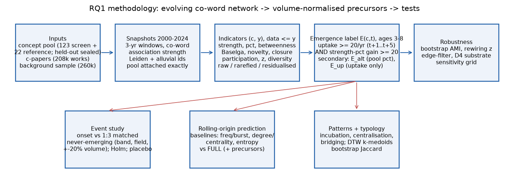

# How new concepts grow in the knowledge network — RQ1 test (iteration 2)

A network-only test of **RQ1**: which temporal and structural changes in an evolving co-word knowledge network
precede the emergence of new scientific concepts, once concept **volume** is controlled for.
The study uses the iteration-1 concept pool (123 screen + 22 reference concepts; 61 held-out concepts stay sealed)
and a design-weighted whole-science background sample. It makes no API or LLM calls ($0).

The pipeline:

1. Build **25 yearly concept–concept snapshots** (2000–2024), each pooling a 3-year trailing window from the
   post-stratified background sample (259,716 works). Nodes are legacy concept tags (score ≥ 0.3, level ≥ 1).
   Edges carry association-strength weights; the kept graph has ≥ 2 raw co-occurrences. Communities come from
   Leiden (RBConfiguration, best of 5 seeds) with alluvial Jaccard matching across years. Pool concepts are
   attached *exactly* from their c-papers.
2. Build the yearly **concept–subfield bipartite** (counts and per-10⁴ incidence).
3. Compute **per-(concept, year) indicators using data ≤ y only**, in three forms: raw, rarefied (m = 10 c-papers,
   50 draws) and residualised on log volume + age. The indicators are:
   - strength and its growth, strength percentile, sampled betweenness;
   - new-relation rate, neighbourhood growth and novelty;
   - the Baselga β_sim/β_sne partition and the accretion shift;
   - top-20 closure against the Chung-Lu expectation;
   - participation P, within-module z, community membership and change;
   - subfield count, Shannon H, Rao-Stirling diversity;
   - Kleinberg burst state (computed on the series truncated at y) and the preferential-attachment (PA) score.
4. Label network-only **emergence E(c,t)**:
   uptake (mean ≥ 20 c-papers/yr over t+1..t+5, no fall > 30 %) **and** a strength-percentile gain ≥ 20 points (t → t+5).
5. Run a **matched event study**: onset concepts vs 1:3 never-emerging controls, matched on F-band,
   origin-field group and ±20 % 3-year volume. It reports concept-bootstrap CIs, Holm correction over the
   3 pre-named precursors, and raw / rarefied / residualised versions ("volume in disguise"). It also includes a
   placebo, band-only matching, and the pre-declared pooled concept-year panel (fallback F2).
6. Run **rolling-origin prediction** (L2 logistic primary, HistGB secondary). The frequency/burst,
   degree/centrality-growth and entropy-growth **baselines** are compared with the same model augmented by the
   precursors (FULL). ΔAUC / ΔR² come with concept-bootstrap CIs.
7. Detect **three pre-specified patterns** (incubation→expansion, gradual centralisation, early bridging) and fit a
   **DTW + k-medoids typology** (bootstrap-Jaccard stability).

`spec.json` holds the frozen configuration. Its sha256 is written before any label is computed and is repeated in
`results_summary.json`.



## Headline results (all numbers from `results_summary.json`)

**Label yield — the primary E definition is too strict for this pool.**
- Pool concepts sit in the bottom ~5 % of legacy-concept strength (median screen percentile 0.7 in 2005, 5.5 in
  2018), so a 20-point percentile gain is rare.
- Result: E rate 2.1 % of 419 eligible concept-years, **4 onset concepts** (86 never-emerging).
- The pre-declared sensitivity grid shows that the percentile threshold, not the uptake threshold, is binding:
  gain ≥ 10 gives 15 onsets and gain ≥ 30 gives 0, whatever the uptake threshold.

**Following fallback F2, the primary results are an UNDERPOWERED PILOT.** Two further label variants are therefore
reported. **Both were promoted to full analyses after the primary n was seen; this is disclosed in
`results_summary.json → label_note`.**
- **E_alt**: the pre-declared sensitivity that computes the percentile among pool + reference nodes only.
  14 onsets, 10 matched.
- **E_up**: the pre-declared uptake-only component, i.e. sustained uptake. 41 onsets, 21 matched.

**Event study** (S = mean treated − control difference over relative years −3..0; 95 % concept-bootstrap CI):

| label | precursor (predicted sign +) | S [95 % CI] | Holm p | residualised S [CI] | pooled-panel coef [CI] |
|---|---|---|---|---|---|
| E (n = 3 matched) | accretion shift (rar.) | −0.104 [−0.120, −0.016] | pilot | −0.104 [−0.119, −0.015] | −0.031 [−0.070, 0.005] |
| E | closure (log obs/Chung-Lu) | −0.625 [−0.656, −0.588] | pilot | −0.567 [−0.707, −0.462] | **−0.871 [−1.219, −0.555]** |
| E | participation (rar.) | 0.143 [−0.119, 0.301] | pilot | 0.142 [−0.123, 0.302] | 0.153 [0.006, 0.286] |
| E_alt (n = 10) | accretion shift | −0.021 [−0.033, 0.093] | 1.0 | −0.020 [−0.033, 0.093] | −0.010 [−0.052, 0.035] |
| E_alt | closure | −0.400 [−0.919, 0.190] | 0.50 | −0.327 [−0.879, 0.203] | **−0.529 [−1.011, −0.099]** |
| E_alt | participation | −0.044 [−0.227, 0.102] | 1.0 | −0.047 [−0.218, 0.107] | 0.002 [−0.101, 0.100] |
| E_up (n = 21) | accretion shift | −0.140 [−0.185, 0.018] | 0.18 | −0.140 [−0.183, 0.016] | −0.033 [−0.083, 0.011] |
| **E_up** | **closure** | **−0.837 [−1.260, −0.427]** | **0.003** | **−0.731 [−1.179, −0.288]** | **−0.743 [−1.062, −0.464]** |
| E_up | participation | −0.007 [−0.066, 0.056] | 0.82 | −0.009 [−0.066, 0.052] | 0.009 [−0.055, 0.070] |

How to read the table:
- **Closure** is the only precursor with a consistent signal, and it runs in the **opposite** direction to the
  prediction. Before onset, concepts that go on to emerge have *less* clustered (more open) association-strength
  neighbourhoods than volume-matched controls. This holds in the residualised version, in the pooled panel for
  all three labels, and for E_up after Holm correction. The placebo S covers 0 for every label.
- The **accretion shift** is almost never measurable before onset. Rarefied Baselga needs ≥ 10 c-papers in two
  consecutive years, and that version is NA for 55 % of pre-2016 concept-years. Its MDE is 1.4–2.1 SD, so the
  accretion hypothesis is untested, not refuted.
- **Participation** shows no divergence for E_up, with adequate power (MDE 0.085 = 0.47 SD).
- **Exploratory rows** (Benjamini-Hochberg q < 0.05):
  - E_up: new-relation rate (+0.128), neighbourhood novelty (+0.156), within-module z (+0.073) and Kleinberg burst
    state (+0.171) are all higher before sustained uptake.
  - E_alt: novelty (+0.139), subfield count (+1.68) and burst state (+0.171) are higher, and the rarefied
    nestedness share is lower (sne_share_rar −0.081, β_sne_rar −0.032). Neighbourhood change before onset is
    replacement rather than accretion, the reverse of the accretion hypothesis.
- **Balance after matching** on log vol3: SMD 0.80 for E (n = 3), 0.06 for E_alt and 0.27 for E_up. Entropy H stays
  imbalanced (0.49–0.96) and should be read as a residual confound.

**Prediction** (pooled rolling-origin test rows, L2 logistic):
- **Sustained uptake (E_up)** has 2 origins, 131 test rows and 42 positives. BASELINE AUC is 0.890 and FULL is 0.879:
  **ΔAUC −0.010 [−0.045, 0.021]**. HistGB gives +0.019 [−0.025, 0.060]; both CIs cover 0. The precursors add
  **no value beyond the volume/burst, degree and entropy baselines**. Frequency/burst alone reaches 0.878.
- **Primary E and E_alt** each have one usable origin (2019) with only 2–3 positives, so they are a pilot.
  - E: ΔAUC −0.028 [−0.094, 0.019].
  - E_alt: ΔAUC +0.051 [0.000, 0.132].
  - Logistic and HistGB disagree in sign for both.
- **Centrality gain R²** (Ridge): ΔR² −0.15 [−0.52, 0.19]. HistGB: −0.19 [−0.31, −0.05], so the extra features
  hurt there. Absolute R² is ≤ 0.45, with frequency/burst the best family.
- **Subfield gain R²**: inconclusive, ΔR² +0.17 [−0.17, 0.67] (Ridge) and +0.01 [−0.29, 0.20] (HistGB).
- The label-shuffle control gives mean ΔAUC ≈ 0 (−0.021 ± 0.13 for E, −0.019 ± 0.08 for E_alt). A leakage test
  recomputes 24 features for 5 random (c, t) with all data after t removed and finds them identical.

**Patterns (123 screen concepts, ages 0–8)**
- **Early bridging** (P_raw > 0.6 or cross-community betweenness in year F / F+1) is the majority pattern: 76 %
  [69, 84]. It does not separate emerging from never-emerging concepts under any label (E_up 0.78 vs 0.78).
- **Gradual centralisation** occurs in 3 % [1, 7] of concepts. Over ages 0–8 it is 7 % for E_up emerging vs 0 %
  for never (Fisher p = 0.09); pre-onset it is 5 % vs 0 % (p = 0.20).
- **Incubation → expansion** never occurs as operationalised: 0 %.
  - Strength growth above the pooled 90th percentile happens only in the birth years (p90 = 3.97 log-units at
    age 0, 1.60 at age 1, ≤ 0.72 from age 3), while quiet low-turnover runs occur only later.
  - Concepts in this pool are **born expanding and then consolidate**.
  - The declared age-adjusted sensitivity finds the pattern in 1.6 % of concepts.

**Typology**
- No stable network typology: the minimum bootstrap Jaccard is 0.49 at k = 2 and 0.42–0.51 for k = 3–6.
- Only 59 concepts have complete age-0..8 series, which introduces survivor bias.
- An entropy-only (H) typology is very stable (Jaccard 0.95) and shares little with the network typology (AMI 0.14).
- The typology is labelled PRELIMINARY.

**Substrate and robustness** (`results/robustness.json`) — see the section [Robustness](#robustness) below.

**Verdicts** (`results_summary.json → verdicts`):
- The pre-named "positive precursor" hypotheses (accretion +, closure +, participation +) are **not supported**.
- Closure is **disconfirmed with the opposite sign** (E_up, n = 21, pilot < 30).
- Participation is disconfirmed for E_up.
- Accretion is underpowered.
- For sustained uptake, the precursors add no out-of-sample value beyond volume/degree/entropy baselines.
- The pattern that best characterises emergence here is *open, novel, fast-renewing neighbourhoods* (low closure,
  high novelty and new-relation rate, burst state). That is **descriptive, not predictive, beyond volume**.

## Layout

| path | content |
|---|---|
| `method.py` | Orchestrator and main entry point. It writes `spec.json`, runs the leakage test, labels, event study, prediction, patterns, typology and figures, then writes `method_out.json` and `results_summary.json`. `--all` also runs every stage. |
| `config.py` | Paths to the dependency workspaces, the frozen `SPEC`, the sealed-fold guard, and logging / RAM helpers. |
| `lib_metrics.py` | Pure metric functions: association strength, Baselga, participation, within-module z, Chung-Lu closure, Kleinberg (truncated), Shannon / Rao-Stirling, rarefaction, SMD, Holm, BH. |
| `netcore.py` | Weighted co-occurrence graph builder (sparse) and Leiden best-of-n. |
| `stage_prep.py` | Loads and verifies the inputs (fold counts 123/61/22, 208,374 works, 259,716 background rows, tag-id overlap 0.918). Writes the compact tables to `work/`. |
| `stage_snapshots.py` | Builds the 25 snapshots, pool attachment, betweenness and alluvial persistent ids. |
| `stage_indicators.py` | Builds the Rao-Stirling distance matrix, the concept-subfield bipartite and the per-(c, y) indicators. |
| `stage_robust.py` | Leiden bootstrap AMI, rewiring null for closure, edge-filter sensitivity, dataset_4 substrate check, grounding lookup. |
| `analysis_event.py` | Labels, sensitivity grid, reference-arm control, matching, event study, placebo, pooled panel. |
| `analysis_predict.py` | Feature sets, rolling-origin models, concept-bootstrap ΔAUC / ΔR², grouped-CV sanity check, shuffle test. |
| `analysis_patterns.py` | The three patterns and the DTW + k-medoids typology. |
| `make_previews.py` | Writes `mini_method_out.json` / `preview_method_out.json`. |
| `audit_headlines.py` | Independent re-derivation of the headline numbers through different code paths (pandas labels, merge-based event study, statsmodels panel, rank-sum AUC), with swap/shuffle controls. Writes `results/audit_headlines.json`. |
| `reproducibility.md` | Exact environment, commands, seeds, runtimes and expected numbers. |
| `full_method_out.json`, `mini_method_out.json`, `preview_method_out.json` | Formatted full / 3-example / truncated variants of `method_out.json`. |
| `tests/test_metrics.py` | Unit tests with hand-computed answers (13 tests). |
| `spec.json` | Frozen configuration, clarifications and sha256. |
| `method_out.json` | `exp_gen_sol_out`. One example per eligible screen (c, t) with its features ≤ t. `output` is the primary E. `predict_*` holds the out-of-sample scores of every feature set and model for E, E_alt and E_up. |
| `results_summary.json` | Every count, table and verdict. |
| `results/indicators/concept_year_indicators.{parquet,csv}` | 2,618 concept-years × 96 columns (raw / `_rar` / `_res`). This is the building block for iteration 3, roles, S1/S2 and cases. |
| `results/indicators/indicator_summary.json` | Volume-correlation checks and NA shares. |
| `results/concept_subfield/edges.parquet` | Yearly concept × subfield counts and per-10⁴ incidence. |
| `results/concept_subfield/rs_distance.parquet` | The fixed 2000–2004 Rao-Stirling distance matrix. |
| `results/labels/emergence_screen.{parquet,csv}` | E, E_up, E_cg, E3, E_alt, gains, onsets and groups per (c, t). |
| `results/event_study/` | Per-label `summary*.json`, per-treated × k contributions (`contrib*.parquet`) and matches. |
| `results/prediction/` | `predictions.parquet` (every test score) and `summary.json`. |
| `results/patterns/`, `results/typology/` | Per-concept pattern flags, frequencies, cluster assignments, medoids and stability. |
| `results/robustness.json`, `results/snapshot_summary.csv` | Robustness checks and per-snapshot graph statistics. |
| `figures/` | Methodology diagram, event studies (E, E_alt, E_up), trajectories by label, ΔAUC forest, pattern bars, typology series, alluvial summary. |
| `work/` | Regenerable intermediates: compact inputs, `snapshots/` (edges, nodes, pool metrics, pool-pool edges per year), `communities/`. It stays on the run's volume. Every file is < 100 MB, so it is also published. |
| `logs/` | Run logs. |

## How to run

```bash
uv venv .venv --python=3.12
uv pip install --python=.venv/bin/python -r pyproject.toml
.venv/bin/python -m pytest -q -c pytest.ini tests          # unit tests
OMP_NUM_THREADS=1 .venv/bin/python method.py --all        # full pipeline (~27 min on 4 CPUs)
OMP_NUM_THREADS=1 .venv/bin/python method.py              # analysis only (~2 min), needs work/ and results/indicators/
.venv/bin/python make_previews.py
.venv/bin/python audit_headlines.py                        # independent re-derivation of headline numbers
```

Dependency artifacts are read from sibling folders `../../../round-1/<artifact>` (override with `AII_DEPS_ROOT`); see `reproducibility.md`.

The inputs are read (read-only) from the iteration-1 dependency workspaces configured in `config.py`:
- `gen_art_dataset_1`: the pool, c-paper links, works and denominators.
- `gen_art_dataset_2`: the background sample, concept levels and post-stratification totals.
- `gen_art_dataset_4`: the substrate cross-check and the grounding lookup.

To rerun on the iteration-3 enlarged or classifier-accepted pool, change the fold filter in `stage_prep.py`.
The held-out fold and the focal years 2016–18 stay sealed through `config.assert_not_sealed`.

## Declared clarifications and deviations

- The clarifications (i)–(vii) are in `spec.json → spec.clarifications`: raw ≥ 2 kept edges, frame-type vs
  all-type c-papers, the H1 unknown subfield, the definition of cross-community betweenness, post-stratified
  weights, residualised versions used only in the event study, and the percentile definitions.
- **Label variants.** The primary E definition is kept. E_alt (pre-declared sensitivity percentile) and E_up
  (pre-declared component) were promoted to full analyses after the primary yield (4 onsets) was seen.
- **Rolling origins.** Only 2019 is usable for E and E_alt; 2015 and 2019 are usable for E_up. Horizon-3 E3 has
  1 positive in total. Primary prediction is therefore a single-origin pilot, and a grouped-CV sanity check is
  reported (not a headline).
- **Rarefaction.** Rarefied Baselga is NA for 55 % of pre-2016 concept-years, which is more than 40 % and triggers
  fallback F4. The m = 5 versions (`*_rar5`, `P_rar_m5`) are reported as sensitivities.
- **Incubation pattern.** An age-adjusted expansion threshold was added as a post-hoc, declared sensitivity.
- **Bootstrap for Leiden stability.** Resampled works are collapsed to unique works with multiplicity weights, so
  a duplicated work cannot create a kept edge on its own.
- **Reference arm (negative control).** The E rate is 6.3 % (4/22 concepts ever E), not ≈ 0, although the median
  |5-year percentile gain| is 3.4 points (< 10). The reference concepts' median c-paper volume grows from 55 (2005)
  to 156 (2018), against ~1.7× growth for all science. This points to pool-wide coverage drift (arXiv growth and
  S2→OpenAlex mapping, which improves over time). Matched comparisons at the same calendar year cancel this drift;
  absolute E rates do not.
- The pool is dominated by physics, astronomy, CS and the physical sciences, so conclusions are scoped to these
  origin fields. The concepts are not yet grounded (21 have `sense_check_fail`; a secondary population drops them).

## Robustness

Source: `results/robustness.json` and `results/snapshot_summary.csv`.

- **Snapshots.** Median values: 27.6k works per window, 27.2k nodes, 466k edges, 84k kept edges (raw ≥ 2) and
  12.7k kept nodes. Each snapshot has 41–108 communities with ≥ 5 nodes, and modularity is 0.66–0.95 (0.95 median).
  Alluvial matching (Jaccard ≥ 0.3) finds 772 continuations against 1,487 births, 1,394 deaths, 286 merges and
  256 splits over 25 years. **Community identity is not stable from year to year**, so `comm_change` and
  persistent-id quantities are noisy.
- **Leiden stability** (20 within-stratum bootstrap resamples each for 2008, 2013 and 2018; duplicates collapsed to
  weights): mean AMI with the main partition is 0.63 / 0.62 / 0.62, and the 5th percentile is 0.62 / 0.61 / 0.60.
  This is at the ≥ 0.6 bar, so community-based quantities (P, z, bridging) are usable but noisy.
- **Edge-filter sensitivity** (kept graph raw ≥ 1, 2013): partition AMI with the main partition is 0.43, and the
  Spearman correlation of pool P_raw is 0.78. Partitions depend on the filter; participation ranks mostly survive.
- **Closure null (degree-preserving rewiring)**, 20 × 10|E| swaps on the kept graph, for every pool concept with ≥ 5
  of its top-20 AS neighbours in the kept graph (75 / 118 / 120 concepts):
  - 79 % / 72 % / 63 % of neighbourhoods are denser than all rewired nulls (empirical p < 0.05).
  - Median observed density is 0.08 / 0.07 / 0.04, against null medians ≈ 0.
  - Spearman of the Chung-Lu closure log-ratio with the binary observed/null log-ratio is 0.45 / 0.59 / 0.56.
- **Independent substrate (dataset_4 stratified corpus, 93.6k works ≤ 2016, concept names mapped at 85 %).**
  - Pool percentile *gains* 2008 → 2013 correlate with the main substrate at Spearman 0.98 (n = 87).
  - The median overlap (Jaccard) of top-20 AS neighbours is 0.43 (2008) and 0.29 (2013).
  - Percentile *levels* are trivially rank-identical (see `note`).
- **Volume dependence** (screen concept-years, Spearman with log vol3):
  - Rarefied / normalised versions: P_rar −0.05, accretion_shift_rar 0.03, H_rar 0.21, closure 0.31.
  - Raw counterparts: P_raw 0.05, H 0.40, raw closure (log obs) −0.64.
  - β_sim_rar rises to 0.39, because rarefied sets at m = 10 saturate.
- **Grounding lookup.** None of the 145 active phrases occur in dataset_4's LLM-labelled phrase set or its phrase
  pool (both were mined from a different corpus), so grounding labels must come from the iteration-3 classifier.
- **Controls.**
  - Placebo event studies (pseudo-onsets for never-emerging concepts) cover 0 for all three precursors under all
    three labels.
  - Label shuffles give ΔAUC ≈ 0.
  - The leakage test passes (24 features, 5 random concept-years, data after t removed).
  - Runs are deterministic: networkit pivots, igraph rewiring, Leiden, rarefaction and bootstraps are all seeded,
    and two consecutive runs give identical verdicts and prediction tables.
  - Bootstrap CIs change by < 10 % between 500 and 1,000 replicates (`ci_change_500_vs_1000`) for every precursor
    row except the primary-E raw accretion row (39 %; n = 3 matched).

## Restoring removed files

Entries marked `delete` in `.aii/manifest.yaml`:
- `.venv/` (redownloadable): `uv venv .venv --python=3.12 && uv pip install --python=.venv/bin/python -r pyproject.toml`
- `__pycache__/`, `tests/__pycache__/`, `.pytest_cache/` (regenerable): recreated automatically by running the
  scripts or `.venv/bin/python -m pytest -q -c pytest.ini tests`.

`work/` and `results/` need no manifest decision (every file is small) and stay on the run's volume at these relative paths. Every file is below 100 MB, so they are
also in the published repository. To rebuild `work/` from scratch:
`OMP_NUM_THREADS=1 .venv/bin/python method.py --all`.
